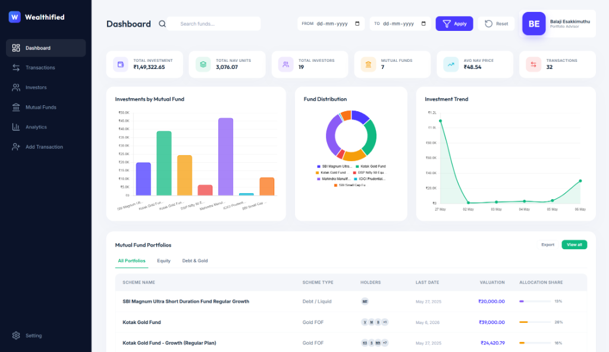
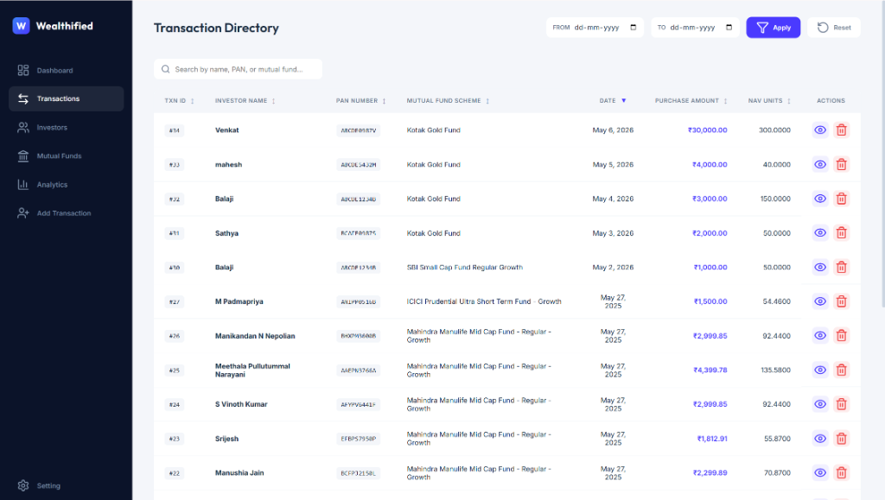
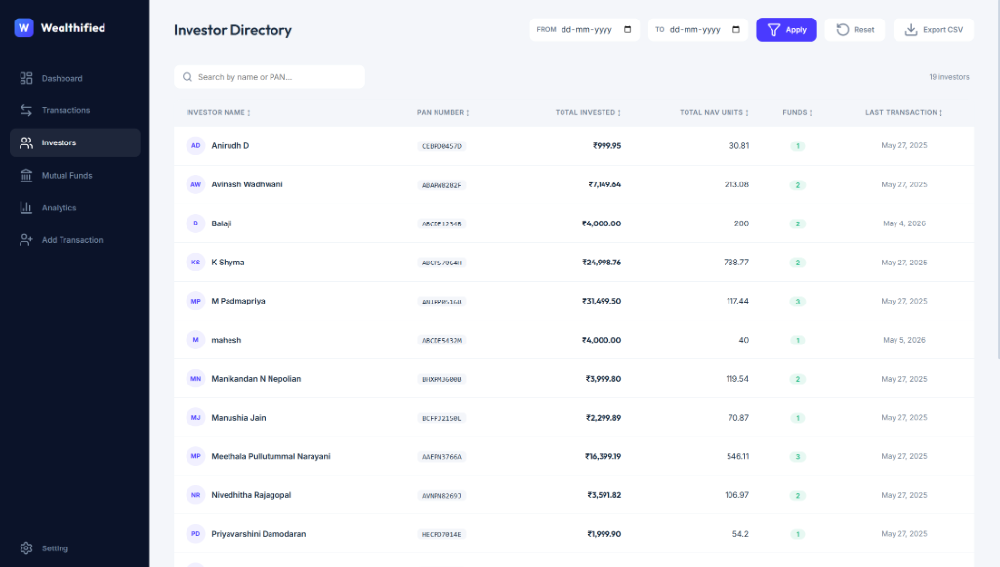
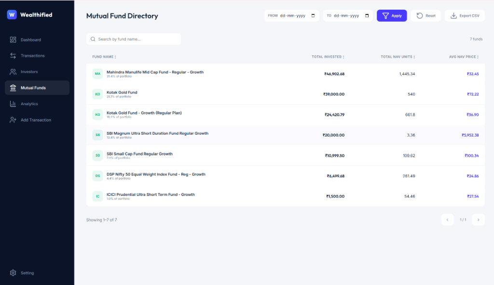
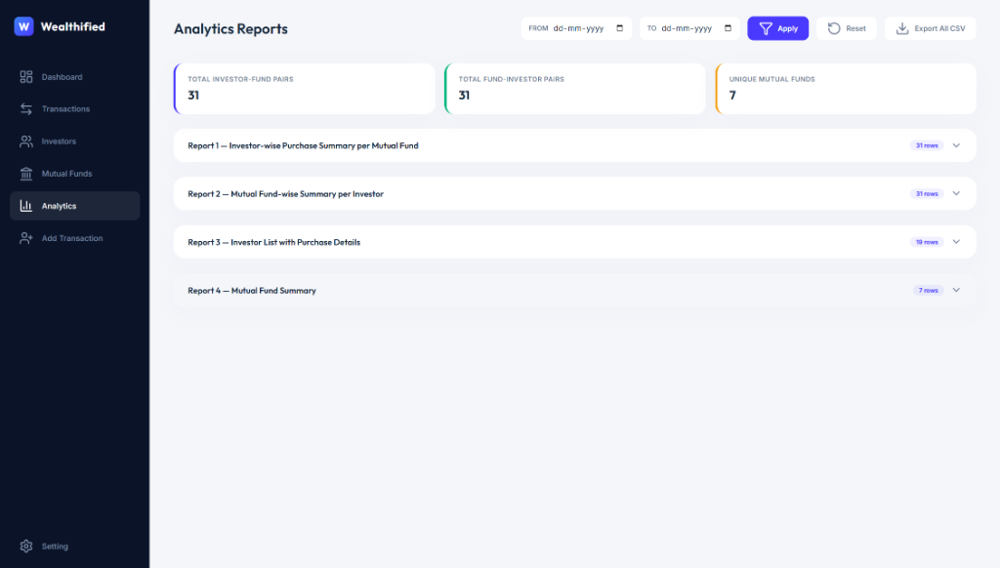
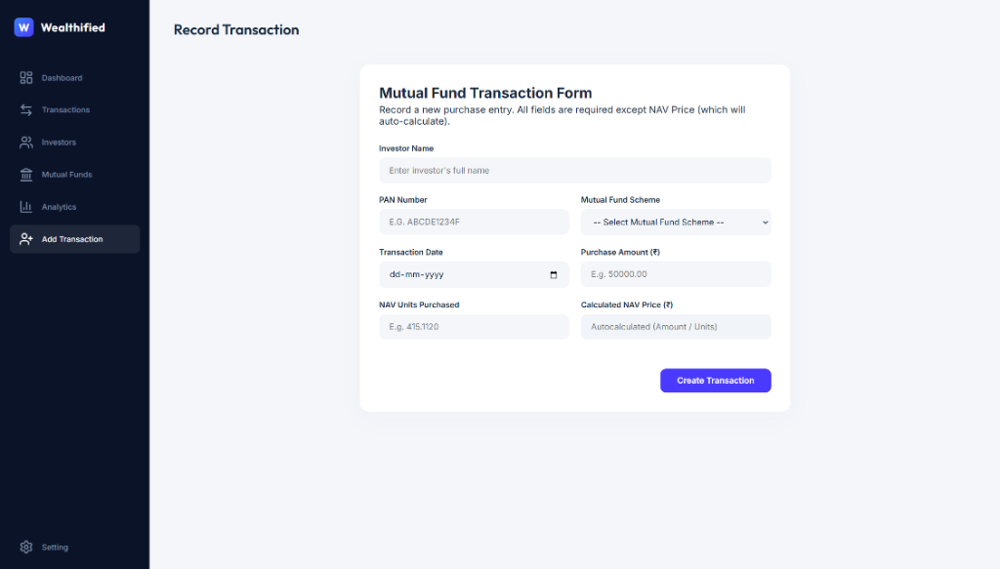

# Wealthified - Mutual Fund Transaction Analytics Dashboard

Wealthified is a modern, high-performance, full-stack dashboard designed to aggregate, track, and summarize mutual fund transactions. Built with a **Python (FastAPI)** backend, a **PostgreSQL** database, and a responsive **Vanilla HTML/CSS/JS** frontend featuring interactive visualizations, custom filters, and data export tools.

---

## 🛠️ Dependencies & Tools Required

To run this project locally, you need the following installed on your system:

1. **Python 3.8+**
2. **PostgreSQL Database Server**
3. **Node.js** / **npm** (Optional, for running lightweight servers; Python can be used instead)
4. **Modern Web Browser** (Chrome, Edge, Firefox, Safari)

### Required Python Packages
These are listed in `backend/requirements.txt`:
* `fastapi` & `uvicorn` (Backend API Server)
* `sqlalchemy` (SQL Toolkit and ORM)
* `psycopg2-binary` (PostgreSQL Database Driver)
* `pydantic` & `pydantic-settings` (Data Validation and Settings management)

---

## 🚀 Setup Instructions

### 1. Database Configuration
1. Start your **PostgreSQL** server.
2. Log in to your PostgreSQL terminal (`psql` or pgAdmin) and create a new database:
   ```sql
   CREATE DATABASE wealthfeed_db;
   ```
3. Copy `backend/.env.example` to `backend/.env` in the project root:
   ```env
   DB_HOST=localhost
   DB_PORT=5432
   DB_NAME=wealthfeed_db
   DB_USER=postgres
   DB_PASSWORD=YOUR_POSTGRES_PASSWORD
   ```
   *Replace `YOUR_POSTGRES_PASSWORD` with your actual local PostgreSQL password.*

### 2. Python Environment Setup
Activate your virtual environment and install the required modules:
```bash
# 1. Create a Python virtual environment
python -m venv venv

# 2. Activate the virtual environment
# On Windows (PowerShell):
venv\Scripts\Activate.ps1
# On Windows (CMD):
venv\Scripts\activate.bat
# On macOS/Linux:
source venv/bin/activate

# 3. Install packages
pip install -r backend/requirements.txt
```

### 3. Database Migration & CSV Seed
To set up database tables and import transaction data from the CSV file automatically:
```bash
python dataset/import_csv.py
```
*Note: This script initializes the database tables and populates them with sample records from `dataset/transactions.csv`.*

---

## 🏃 How to Run the Application

To run the application, you need to launch both the **Backend API Server** and the **Frontend client**.

### 1. Launch Backend API
With your virtual environment active, start the FastAPI server:
```bash
uvicorn backend.app.main:app --reload
```
* The API server will start at **`http://localhost:8000`**
* View the interactive API documentation (Swagger UI) at **`http://localhost:8000/docs`**

### 2. Launch Frontend Client
Since the frontend consists of static files, you can:
* **Double-click** on `frontend/index.html` to open it directly in a browser.
* Or, run a local static file server (recommended):
  ```bash
  # Go to frontend folder
  cd frontend
  # Start Python's built-in server
  python -m http.server 3000
  ```
  Open **`http://localhost:3000`** in your web browser.

---

## 📊 How to See the Output Details

Once the application is running, navigate through the dashboard sidebar to explore details:

1. **Dashboard**: View high-level metrics (Total Investment, NAV Units, Investors count) and interactive charts (Investments by Mutual Fund, Fund Distribution percentage, and Investment Trends). Apply date filters to view custom date ranges.
2. **Transactions**: Browse list of all raw transactions, search by name, sort columns, paginate results, and download reports as CSV.
3. **Investors**: Access the investor list directory, view aggregate assets, and click on an investor to open their **Portfolio Details** containing their personal transaction log history and scheme allocation chart.
4. **Mutual Funds**: View performance stats of all individual mutual fund schemes and their average unit acquisition price.
5. **Analytics**: Drill down into multi-dimensional aggregate reports (Investor-wise schemes purchase summary, Mutual fund-wise investor details).
6. **Add Transaction**: Submit new purchases easily using a secure form with a built-in static scheme dropdown.

---

## 🖼️ Output Screens

### 1. Main Analytics Dashboard
Shows the KPI summary cards, bar charts, doughnut fund distributions, and investment trends.


### 2. Transaction Directory
Complete log of all mutual fund transaction records with pagination, searching, sorting, and export capabilities.


### 3. Investor Directory
Directory listing of active investors with search filters, fund holdings statistics, and individual CSV download.


### 4. Mutual Fund Directory
Breakdown of active mutual funds, total invested amounts, total units, and average nav values.


### 5. Multi-dimensional Analytics Reports
Collapsible multi-level reports for compliance, audits, and overall scheme allocations.


### 6. Record Transaction Form
Form to insert a new mutual fund purchase entry with a dropdown for scheme selection and automatically calculated NAV prices.


